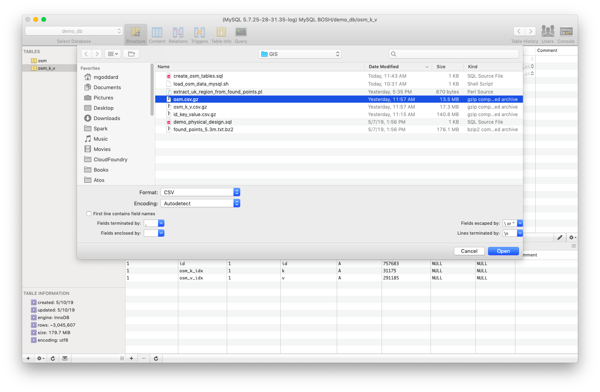

# A Little MySQL Exercise, with Data

## Once the DB is deployed, we can experiment a little bit

There is a small extract of the Open Street Map (OSM) "planet dump" from March 2016, covering a
portion of the UK, loaded into S3 and publicly accessible.  In this exercise, we just create a
few tables, one of which is only for loading, so we can discover things about MySQL as well as
how interacting with it on a cloud differs from using it locally.

This assumes we've left off right after having started up that SSH tunnel, which has the side
effect of leaving us a shell prompt on the MySQL VM, which can be used to expedite data loading,
so long as the deployment was to Amazon EC2.  We can, of course, use whichever data loading
approach we like, and [Sequel Pro](https://github.com/sequelpro/sequelpro/releases)
has a very nice data import UI (see below) you can use, but
that will involve a network hop which will slow things down some.



### Run the DDL

The `osm` table contains an ID for the place, the date it was updated, the ID of the user who updated
it, and the latitude and longitude of its location.

The `osm_k_v` table contains the place ID plus (key, value) pairs of attributes of the place.  For example,
a place may have a key of _amenity_ and a corresponding value of _pub_.

[Here](./create_osm_tables.sql) is the DDL.  I suggest stepping through it statement by statement,
to see what's going on there.

### Load the data set

[This script](./load_osm_data_mysql.sh) will load the data when run from the shell on the MySQL VM.
You'll first need to edit the three values defined on lines 4-6.  I suggest just editing a file on
the VM, pasting this script's contents into it, adjusting those three lines, and running it.

Alternatively, if you prefer to load them using Sequel Pro or some other client, here are the two
data files:

[`osm`](https://s3.amazonaws.com/goddard.datasets/osm.csv.gz)

[`osm_k_v`](https://s3.amazonaws.com/goddard.datasets/osm_k_v.csv.gz)

### Experiment with some queries against this data

I think I started with something like this, prior to adding those indexed on `k` and `v`:

```
select v, count(*)
from osm_k_v
where k = 'amenity'
group by 1
order by 2 desc
limit 30;
```

I then added the indexes, tried it again, and noticed the change.  Since the data has a geospatial aspect,
some of the built-in MySQL GIS capabilities would be interesting to try out.
[Here](https://dev.mysql.com/doc/refman/8.0/en/spatial-geohash-functions.html), for example, is some
documentation on `ST_GeoHash(longitude, latitude, max_length)`.
[This table](https://en.wikipedia.org/wiki/Geohash#Number_of_geohash_characters_and_precision_in_km) may
also be helpful.

